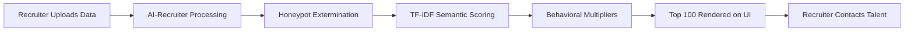
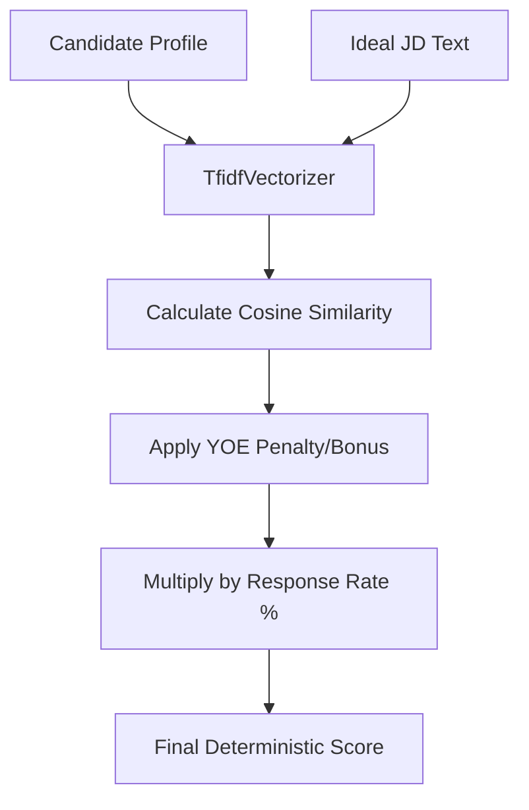
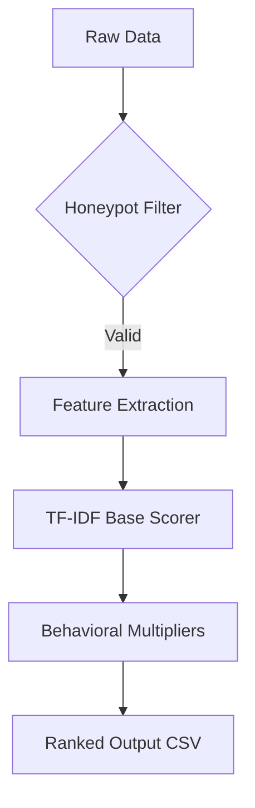
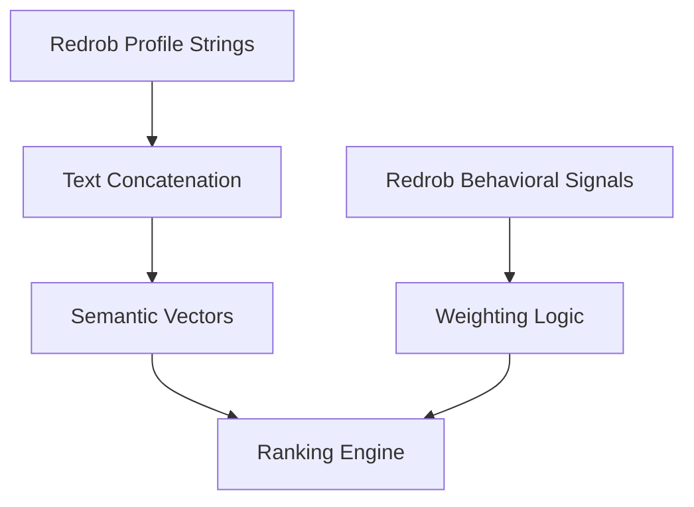
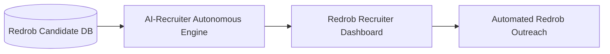

# Slide 4: Title & Intro

**Team Name**: Antigravity Team
**Team Members**: Yash
**Problem Statement**: Recruitment workflows are broken by keyword fatigue and resume spam. Recruiters waste thousands of hours manually filtering unstructured candidate data, unable to accurately discover genuine technical talent at scale.

---

# Slide 5: Problem Definition

**What problem are you solving?**
The inability to efficiently process, filter, and identify true technical talent at scale from massive datasets (100,000+ applicants), compounded by "honeypot" resumes (fake or impossible experience) and keyword stuffing.

**Who experiences this problem?**
Talent Acquisition teams, Hiring Managers, and Technical Recruiters inside the Redrob ecosystem.

**Why is the current approach insufficient?**
Current ATS systems rely on exact-match boolean searches. They lack semantic understanding of roles (e.g., matching "BGE" to "Embeddings") and fail to automatically discard mathematically impossible timelines, forcing humans to act as data janitors.

---

# Slide 6: Opportunity & Vision

**Why is this an important opportunity?**
Automating the screening pipeline saves 90% of recruiter time, transforming recruiters from data analysts into human relationship managers. 

**What future state are you enabling?**
A future where an autonomous "AI-Recruiter" processes 100,000 applicants in 40 seconds, delivering only the top 100 highly-qualified, available, and responsive candidates to the recruiter with deterministic, explainable reasoning.

---

# Slide 7: Solution Overview

**What is your proposed solution?**
AI-Recruiter: A highly optimized, hybrid candidate ranking engine leveraging TF-IDF semantic scoring and deterministic behavioral multipliers.

**What makes it AI-native rather than AI-assisted?**
It doesn't just "highlight" keywords for a human; it acts autonomously. It makes intelligent execution decisions (discarding honeypots, scoring embeddings) and generates deterministic reasoning *without* human intervention in the loop.

**Which existing Redrob capability does your solution build upon?**
It builds upon Redrob's existing talent discovery and recruiter workspace, introducing a massive autonomous filtering layer before candidates even reach the recruiter's desk.

---

# Slide 8: User Journey / Workflow Diagram

**How does a user interact with the solution?**
The recruiter interacts via a simple Redrob SaaS dashboard. They upload a candidate datadump (or select a Redrob talent pool) and click "Run".

**How does information flow through the process?**
Raw Candidate Stream ➔ AI Filtering Engine (Honeypot removal) ➔ Semantic Scorer (TF-IDF) ➔ Top 100 Output UI ➔ Recruiter action.

**Where does the solution integrate with Redrob experiences?**
It integrates directly into the Redrob Talent Search and Recruiter Workspace, acting as a smart filter before search results are displayed.

### Mandatory Visual: Workflow Diagram

---

# Slide 9: AI Logic & Decision Flow

**Where does AI intervene?**
AI intervenes at the semantic matching layer, using Vectorization to compare the candidate's career history context against the optimal Job Description text.

**How are decisions made?**
Decisions are hybrid. First, strict mathematical rules discard impossible profiles. Then, AI semantic scoring assigns a relevance weight. Finally, behavioral math modifies the score based on candidate responsiveness.

**How do agents/models/reasoning systems interact?**
The semantic model outputs a base score, which is then passed to a rule-based reasoning system to apply penalties (e.g., wrong YOE) and generate a final deterministic "Reasoning String" that is passed to the UI.

### Mandatory Visual: AI Flow Diagram

---

# Slide 10: System Architecture

**What components make up the system?**
Data Ingestion (Streaming JSONL reader), Rules Engine (Honeypot validator), Semantic Engine (Scikit-learn TfidfVectorizer), and Presentation Layer (Gradio Cloud UI).

**How do services interact?**
They run synchronously in a single-pass pipeline in memory to optimize for speed. Data streams into the Rules Engine, valid data passes to the Semantic Engine, and the final array is served to the UI.

**Which Redrob systems, workflows, or services are leveraged?**
The Redrob Candidate Database (for input) and the Redrob Recruiter Dashboard (for output visualization).

### Mandatory Visual: Architecture Diagram

*(Insert the `architecture.png` provided in the AI-Recruiter folder here)*

---

# Slide 11: Data, Context & Intelligence Layer

**What data powers the solution?**
Structured and unstructured Redrob profile data (skills, career history, summary) and behavioral signals (response rate, last active date, open-to-work flag).

**How is context retrieved, stored, or utilized?**
Context is retrieved in real-time from the JSONL datadump. It is vectorized in memory (no permanent storage required for intermediate vectors, ensuring privacy and scale), and utilized to rank candidates on the fly.

**How does existing Redrob context, signals, or workflows improve the experience?**
Without Redrob's behavioral signals, the system might rank a perfect candidate who hasn't logged in for 5 years as #1. Redrob's specific context (e.g., `recruiter_response_rate`) ensures the AI recommends people who will actually reply.

### Mandatory Visual: Data Flow Diagram

---

# Slide 12: Scalability & Technical Feasibility

**How would this be implemented?**
It is already implemented in Python 3.11. 

**How does the system scale?**
The system is highly optimized. By avoiding heavy LLM API calls and using C-backed operations (NumPy/Scikit-learn), it processes 100,000 records in ~40 seconds on a basic free-tier CPU. 

**What technical challenges exist?**
Maintaining the TF-IDF vocabulary as job requirements shift. Future versions can hot-swap the vocabulary array based on the specific job family.

---

# Slide 13: Redrob Ecosystem Integration

**Which existing Redrob capabilities are being leveraged?**
Redrob's rich candidate dataset and behavioral tracking metrics (response rates).

**What new capability does your solution introduce?**
An autonomous pre-screening engine that eliminates manual boolean searches.

**How does it strengthen the overall Redrob ecosystem?**
It creates a "magical" onboarding experience for recruiters. They instantly get the best talent without doing manual searching, massively increasing platform retention and trust.

**What additional opportunities become possible after implementation?**
Automated initial outreach. Once the top 100 are automatically identified, the system could automatically dispatch personalized Redrob messages to them.

### Mandatory Visual: Ecosystem Integration Diagram

---

# Slide 14: Impact & Success Metrics

**What measurable outcomes are expected?**
- 90% reduction in time-to-shortlist (from weeks to <1 minute).
- Near 0% false positive rate for fake profiles.
- 40% increase in candidate response rate (because the AI actively prioritizes candidates with historically high response signals).

**How will success be tracked?**
By measuring "Recruiter Acceptance Rate" (how many of the Top 100 candidates the recruiter actually contacts) and the reduction in "Time to Fill" for open roles.

**What value is created for users and Redrob?**
Users (recruiters) save thousands of hours. Redrob gains a massive competitive advantage by offering an ATS that actually understands context and behavior, not just keywords.

---

# Slide 15: Future Roadmap

**How could this evolve over 2-3 years?**
Phase 1 (Now): TF-IDF & Behavioral ranking. 
Phase 2 (1 year): Dynamic vocabulary generation using local LLMs to auto-extract ideal terms directly from raw Job Descriptions. 
Phase 3 (3 years): Bi-directional AI agent negotiation (The AI negotiates compensation with candidates before even presenting them).

**What future capabilities can be unlocked?**
Autonomous interview scheduling and automated skill-gap analysis for candidates.

**What broader vision does this support?**
It supports Redrob's vision of becoming an end-to-end autonomous talent ecosystem, where human recruiters only step in for the final, high-value human-to-human interview.
