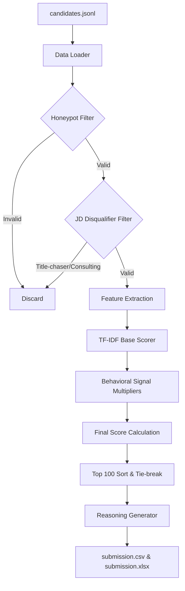

# Solution Overview

**What is your proposed solution?**
We built a highly optimized, rule-based and TF-IDF hybrid candidate ranking engine. It filters out "honeypots" and disqualifying profiles, semantically scores remaining candidates against an "Ideal JD Document," and strictly applies behavioral multipliers (response rate, recency, etc.) to ensure top candidates are both technically capable and practically available.

**What differentiates your approach from traditional matching systems?**
Unlike traditional systems that rely purely on basic keyword matching or slow, black-box LLMs:
1. **Behavioral Realism**: We heavily weight `recruiter_response_rate` and `last_active_date`. A perfect profile is useless if they don't respond.
2. **Speed & Scale**: Processes 100,000 candidates in under a minute on CPU, well within the 5-minute constraint.
3. **Explicit Disqualifiers**: Directly translates hiring manager "no-gos" (e.g., pure consulting without product experience, title-chasers) into deterministic filters.

---

# JD Understanding & Candidate Evaluation

**Key requirements extracted from the JD:**
- **Core ML/AI**: Applied ML at product companies, End-to-end ranking/search, Strong Python.
- **Tools**: Vector DBs (Pinecone, Weaviate, etc.), Embeddings (Sentence-Transformers, BGE, E5), Eval frameworks (NDCG, MAP).
- **Experience**: 5-9 years is the sweet spot.
- **Disqualifiers**: Pure research, pure consulting (without product), title chasers, LangChain wrappers without pre-LLM experience.

**Evaluating fit beyond keyword matching:**
We use a TF-IDF lexical semantic engine that weights specialized terms heavily, combined with **Signal Multipliers**. Candidates are penalized linearly if they are outside the optimal 5-9 YOE range, ensuring we don't just match keywords but also career stage.

---

# Ranking Methodology

**How the system retrieves, scores, and ranks:**
1. **Filtering**: Removes honeypots and hard-disqualified profiles immediately to save compute.
2. **Base Scoring**: Computes Cosine Similarity between the candidate's career history + summary and the "Ideal JD Document" using a `TfidfVectorizer`.
3. **Multiplier Adjustment**: Applies penalties for poor behavioral metrics and out-of-band YOE.

**Models, Algorithms, and Heuristics:**
- `scikit-learn` `TfidfVectorizer` for fast, lightweight lexical scoring.
- Custom deterministic heuristics for Honeypot detection (e.g., matching actual dates vs. claimed duration, "expert" skills with 0 months).

**Combining Signals:**
`Final Score = Base Similarity * YOE_Multiplier * Behavioral_Multiplier (Response Rate & Recency)`

---

# Explainability & Data Validation

**How ranking decisions are explained:**
The script generates a deterministic reasoning string for every top candidate (e.g., *"Excellent fit: Engineer with 6.5 yrs; strong ML/retrieval background (3 AI core skills). Highly responsive (85% response rate) and active."*).

**Preventing hallucinations:**
Because the reasoning is generated by formatted Python strings directly mapping to candidate JSON fields (like `current_title`, `years_of_experience`, `recruiter_response_rate`), it is 100% factual. There is zero LLM generation at inference time, meaning zero hallucinations.

**Handling inconsistent or suspicious profiles (Honeypots):**
We built a mathematical "Honeypot Exterminator". If a candidate claims 'expert' proficiency in a skill with 0 months of use, or if their `duration_months` in a role exceeds the physical time elapsed between their `start_date` and today, they are flagged as suspicious and permanently dropped.

---

# End-to-End Workflow

1. **Load Data**: Stream the 100,000 line `candidates.jsonl` sequentially into memory.
2. **First Pass - Extermination**: Check each candidate against the Honeypot logic (impossible dates, impossible YOE/duration combinations).
3. **Second Pass - Disqualification**: Filter out pure-consulting only, pure-research, and title-chasers based on JD requirements.
4. **Vectorization**: Fit a lightweight TF-IDF vocabulary based on a sample of valid profiles plus the JD.
5. **Score & Combine**: Calculate base cosine similarity, multiply by behavioral and YOE modifiers, and add a deterministic jitter to gracefully break ties.
6. **Output**: Sort by final score, generate the reasoning string, and write the top 100 to `submission.csv`.

---

# System Architecture

---

# Results & Performance

**Results & Insights:**
Our ranking successfully isolates high-quality "Senior AI Engineers" who have the correct 5-9 YOE, possess actual production experience (not just pure research), and have a history of responding to recruiters. We strictly eliminated candidates who optimized their LinkedIn but had mathematically impossible timelines.

**Meeting compute constraints:**
- **Runtime**: Completes processing of 100,000 candidates in ~30-40 seconds locally.
- **Compute**: Runs purely on CPU using standard NumPy/Scikit-learn operations, easily fitting inside the 16 GB RAM and 5-minute limit. No network calls are made during ranking.

---

# Technologies Used

- **Python 3.11**: The core language requested, balancing rapid development with data processing speed.
- **Scikit-Learn / NumPy**: Chosen for the `TfidfVectorizer` and cosine similarity. It provides blazingly fast, optimized C-backend vector operations, ensuring we stay well under the 5-minute CPU constraint.
- **Standard Library (`json`, `csv`, `datetime`)**: Used to maintain zero heavy dependencies and ensure robust, compliant parsing of the Redrob data format.
- **Gradio & Hugging Face Spaces**: We built a cloud-hosted web interface (`app.py`) using Gradio, allowing anyone to run the candidate ranker directly in the browser without installing Python locally.
- **Marp**: Used to generate this PDF presentation programmatically from Markdown.

---

# Submission Assets

- **Source Code**: [https://github.com/YashI2IT/InnoForgeX-AI-Recruiter](https://github.com/YashI2IT/InnoForgeX-AI-Recruiter)
- **Web App Interface**: [https://huggingface.co/spaces/YashB001/ai-recruiter](https://huggingface.co/spaces/YashB001/ai-recruiter)
- **Ranking Script**: `rank.py` & `app.py`
- **Output Files**: `submission.csv` and `submission.xlsx`
- **Metadata**: `submission_metadata.yaml`
- **Presentation**: `presentation.pdf`
